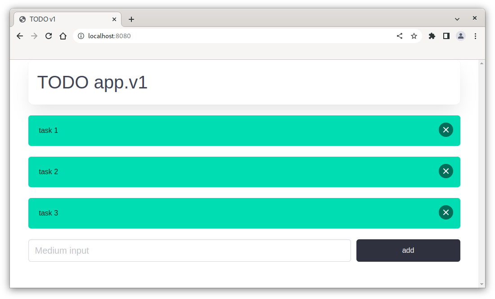

# TODO List v1

Simple application that allows user to store task into database in form of a list.

## Database

Build and run docker with a database instance
```courseignore
$ docker build -t todo .
$ docker run -p 3306:3306 -d todo 
```
## Development

Run development instance
```courseignore
$ mvn spring-boot:run
```

## Preview 

